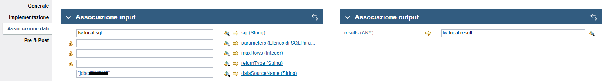

## Get a scalar value from a database query (count, max, top ...)

tw.local.sql = "select count(codice) as COUNTVAL from prodotti"

tw.local.result (**ANY**)

returnType (String) **IMPORTANT!!!** *MUST BE NULL OR EMPTY STRING nonrmally is the type to map, not in this case.*

to get the value: `tw.local.result[0].rows[0].indexedMap.COUNTVAL;`